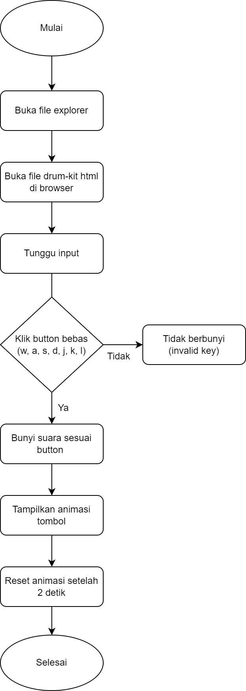

# DRUM KIT WEB

Drum Kit Web adalah aplikasi web sederhana yang memungkinkan pengguna memainkan suara drum menggunakan tombol keyboard atau klik tombol di layar. Aplikasi ini memanfaatkan HTML, CSS, dan JavaScript untuk memutar audio berdasarkan input pengguna.

## Fitur
- **Play Audio**: Memutar audio berdasarkan tombol keyboard yang ditekan atau tombol yang diklik di layar.
- **Animasi Tombol**: Setiap tombol yang ditekan akan berubah warna (merah) sementara dan kembali ke keadaan semula setelah beberapa detik.
- **Suara Drum**: Terdapat beberapa suara drum seperti tom, snare, crash, dan kick bass yang dimainkan sesuai dengan tombol yang ditekan.

## Diagram Flowchart

## Cara Menggunakan
1. Buka file `index.html` di browser.
2. Tekan salah satu tombol keyboard berikut: `W, A, S, D, J, K, L` atau klik tombol yang ada di layar.
3. Suara drum akan dimainkan berdasarkan tombol yang ditekan.
4. Lihat animasi yang muncul pada tombol yang ditekan.

## Struktur Proyek
- **index.html**: Berisi struktur dasar halaman dan tombol-tombol drum.
- **index.js**: Berisi logika JavaScript untuk memainkan audio dan menambahkan animasi pada tombol.
- **styles.css**: Mengatur tampilan visual halaman web dan tombol drum.
- **sounds/**: Folder ini menyimpan file audio drum yang dimainkan.
- **images/**: Folder ini menyimpan gambar yang digunakan pada tombol drum.

> GitHub [@irpanzy](https://https://github.com/irpanzy)
> Twitter [@irpannzy](https://x.com/irpannzy)
> Instagram [@irfanmuriaa](https://www.instagram.com/irfanmuriaa/)